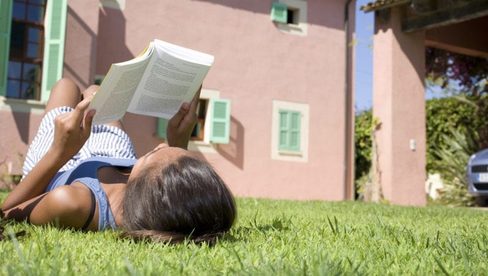

# Summer Reading Programs

Next to the benefits of playing and swimming all day long, 
reading is just about the most important thing kids can do this summer. 
So we put together this list of free kids summer reading programs 
to help keep the learning going over the next few months. 

**Share these kids summer reading programs with students!**

## Barnes & Noble

Kids can earn a **FREE book** after they read eights books and log 
them on the reading sheet. The Barnes and Noble kids summer reading 
program is _only available to children in grades 1–6._ 

Only one book is available for each child who completes a reading journal, 
and the choice must be made from the selected books available at the store.

For more information, click here: [Barnese & Noble](https://www.barnesandnoble.com/h/summer-reading)

## Sylvan Learning Reading Adventure

Sylvan Learning’s Book Adventure program lasts all year long. 
_And it’s free!_ Kids in grades K–8 can search for books, read them offline, 
come back to take a quiz on what they’ve read, and earn prizes for their 
reading success. Prizes include chocolate bars, temporary tattoos, 
Highlights magazine, and more.

> Check your local library for more free kids summer reading programs 
> with activities and incentives for all ages. 
> Most libraries also have story times and other reading-themed activities.

Other places you might check out include:

* Half-Price Books [Half-Price Website](https://www.halfpricebooks.com/fyb/)
* Chuckee Cheese Restaurants [Chuckee Cheese Website](https://www.chuckecheese.com/kids-corner/rewards-calendars)
* Scholastic [Scholastic Website](https://www.scholastic.com/summer/home/)

For the original web page, click here: [Kids earn free books...](https://www.weareteachers.com/10-summer-reading-programs-for-kids/)